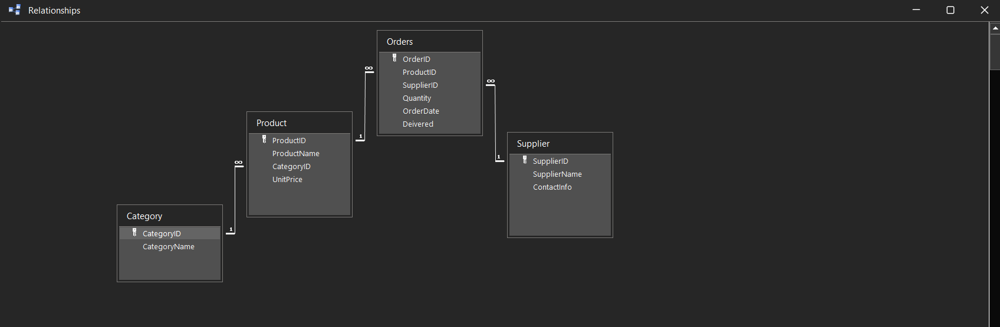

# Simple SupplyChain — Access Inventory Tracker

A small inventory/order tracker built in MS Access, demonstrating relational
schema design, forms, and VBA automation.

## Features
- Linked Products, Suppliers, Categories, and Orders tables
- Data entry forms with navigation, add, and delete
- VBA-driven data quality check (duplicate orders, suspicious quantities)
- One-click export to Excel

## Schema

## Known limitations
- Duplicate detection only catches exact matches
- ...

## How to run
1. Open `SimpleSupplyChain.accdb`
2. Enable content/macros if prompted
3. Use the switchboard buttons to navigate